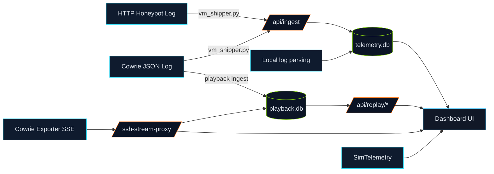

# SENTINEL_HIVE_CYBER

```
+------------------------------------------------------------------+
|  SENTINEL HIVE CYBER                                             |
|  Threat Desk for Honeypot Telemetry                              |
+------------------------------------------------------------------+
```


Sentinel Hive is a Flask dashboard that ingests HTTP honeypot logs and Cowrie SSH logs, normalizes events, and renders live telemetry, session replay, and simulated global threat widgets. Built for cyber security labs, demos, and classroom use.

## Contents

- [Purpose](#purpose)
- [Features](#features)
- [Architecture](#architecture)
- [Data Flow](#data-flow-mermaid)
- [Project Structure](#project-structure)
- [Quick Start](#quick-start)
- [VM Shipper](#vm-shipper-recommended)
- [Configuration](#configuration)
- [API Endpoints](#api-endpoints-key)
- [Storage](#storage)
- [Troubleshooting](#troubleshooting)
- [Security Notes](#security-notes)
- [Demo Checklist](#demo-checklist)

## Purpose

Sentinel Hive provides a single-pane view of honeypot activity with live visibility, replayable sessions, and clean metrics. It helps you:
- Observe HTTP and SSH attack attempts in real time.
- Replay Cowrie sessions for analysis and storytelling.
- Move VM logs into a Windows-hosted dashboard with minimal setup.
- Teach basic telemetry pipelines and SOC-style dashboards.

## Features

- Live dashboard with total events, HTTP/SSH counts, and unique IPs.
- Live HTTP page with recent request attempts and metadata.
- Live SSH page with server-sent events (SSE) stream proxy.
- Session replay from Cowrie tty logs.
- Simulated global telemetry widgets (nodes, alerts, timeline).
- SQLite-backed storage with deduping and retention.

## Architecture

Core pieces:
- Flask app (`app.py`) with routes in `routes/`.
- Metrics DB (`data/telemetry.db`) for normalized events.
- Playback DB (`data/playback.db`) for SSH line replay.
- VM shipper (`vm_shipper.py`) to push new log lines to `/api/ingest`.
- Optional Cowrie exporter SSE stream for live SSH.
- Optional stats APIs for Cowrie/HTTP exporters.

## Data Flow (Mermaid)



Notes:
- If VM ingest is not active, the dashboard can fall back to local log parsing.
- SSH replay requires access to Cowrie tty files and the `playlog` binary.

## Project Structure

```
app.py                  # Flask app entrypoint
config.py               # Environment-driven configuration
routes/                 # UI + API routes
services/               # Log parsing, DBs, SSE proxy, replay
templates/              # HTML templates
vm_shipper.py           # VM log shipper (recommended)
shipper.py              # Older shipper (kept for reference)
data/                   # SQLite databases
```

## Quick Start

Install dependencies on the dashboard host:

```bash
pip install -r requirements.txt
```

Run the dashboard:

```bash
python app.py
```

Open:
- `http://<HOST>:5000/` (Dashboard)
- `/live-http`, `/live-ssh`, `/replay-ssh`, `/ssh-session-replay`

## VM Shipper (Recommended)

Install on the VM:

```bash
pip install requests
```

Run the shipper:

```bash
python vm_shipper.py --dashboard-url http://<DASHBOARD_IP>:5000 --http-log <HTTP_LOG_PATH> --ssh-log /home/cowrie/cowrie/var/log/cowrie/cowrie.json
```

Behavior:
- Tails both logs every 5 seconds.
- Tracks offsets in `offsets.json`.
- Retries on failure with exponential backoff.

## Configuration

Environment variables (defaults in `config.py`):

- `HTTP_LOG_PATH` (default: local `http-honeypot.log` or `~/http-honeypot.log`)
- `SSH_LOG_PATH` (default: local `cowrie.json` or `~/cowrie/var/log/cowrie/cowrie.json`)
- `MAX_EVENTS` (default: `500`)
- `PLAYBACK_DB_PATH` (default: `data/playback.db`)
- `PLAYBACK_RETENTION_DAYS` (default: `0` = keep forever)
- `COWRIE_TTY_PATH` (default: `/cowrie/var/lib/cowrie/tty`)
- `PLAYLOG_BIN` (default: `/cowrie/bin/playlog`)
- `EXPORTER_SSH_STREAM_URL` (default: `http://10.0.96.70:8088/stream/cowrie-log?token=CHANGE_THIS_TO_LONG_RANDOM`)
- `COWRIE_EXPORTER_STATS_URL` (default: `http://10.0.96.70:8088/stats/cowrie`)
- `COWRIE_API_TOKEN` (default: empty)
- `HTTP_EXPORTER_BASE_URL` (default: empty)
- `HTTP_API_TOKEN` (default: empty)
- `SIM_NODE_TARGET` (default: `600`)
- `SIM_SEED` (default: `12345`)
- `HOST` (default: `0.0.0.0`)
- `PORT` (default: `5000`)
- `FLASK_DEBUG` (default: `false`)

## API Endpoints (Key)

- `GET /` Dashboard UI
- `GET /api/events` Recent events + stats
- `GET /api/http-events` HTTP-only events
- `POST /api/ingest` Ingest list of events
- `GET /live-http` Live HTTP page
- `GET /live-ssh` Live SSH page
- `GET /ssh-stream-proxy` SSE proxy for Cowrie exporter
- `GET /replay-ssh` Replay view for playback DB
- `GET /api/replay/range` SSH replay range
- `GET /api/replay/query` SSH replay query
- `GET /ssh-session-replay` Session list UI
- `GET /api/ssh-sessions` Session list
- `GET /api/ssh-session-replay/<session_id>` Stream replay

## Storage

- `data/telemetry.db` stores normalized events and metrics.
- `data/playback.db` stores SSH replay lines.
- Retention for playback is controlled by `PLAYBACK_RETENTION_DAYS`.

## Troubleshooting

- No data on dashboard:
  - Check `HTTP_LOG_PATH` and `SSH_LOG_PATH`.
  - Verify `vm_shipper.py` is running and can reach `/api/ingest`.
  - Delete `data/telemetry.db` to reset metrics.
- SSH replay not working:
  - Ensure Cowrie tty files are accessible on the dashboard host.
  - Ensure `PLAYLOG_BIN` points to a valid `playlog` binary.
- Live SSH stream disconnected:
  - Verify `EXPORTER_SSH_STREAM_URL` and token.

## Security Notes

The ingest endpoint does not use authentication. If you expose this dashboard beyond a lab network, add protections (reverse proxy, firewall, or a shared token).

## Demo Checklist

1. Delete `data/telemetry.db`.
2. Start the dashboard: `python app.py`.
3. Start `vm_shipper.py` on the VM.
4. Generate a few HTTP requests + SSH login failures.
5. Confirm metrics and tables update in real time.

