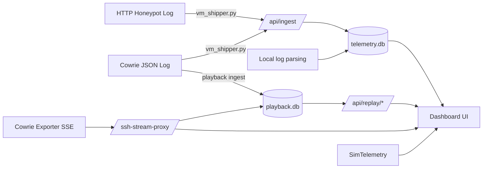

# SENTINEL_HIVE_CYBER

Sentinel Hive is a Flask-based dashboard for honeypot telemetry. It ingests HTTP honeypot logs and Cowrie SSH logs, stores normalized events, and renders live views, replay tools, and simulated global telemetry widgets for training and monitoring.

## Purpose

This project provides a single-pane view of attacks against honeypots. It is designed for:
- Real-time visibility into HTTP and SSH attempts.
- Replay of Cowrie sessions for analysis and demos.
- Lightweight ingestion from a VM into a Windows-hosted dashboard.
- Educational use in cyber security labs.

## Features

- Live dashboard with total events, HTTP/SSH counts, unique IPs.
- Live HTTP page with recent request attempts.
- Live SSH page with server-sent events (SSE) stream proxy.
- Session replay from Cowrie tty logs.
- Simulated global telemetry widgets (nodes, alerts, timeline).
- SQLite-backed storage with simple deduping and retention.

## Architecture Overview

Core pieces:
- Flask app (`app.py`) with routes in `routes/`.
- Metrics DB (`data/telemetry.db`) for normalized events.
- Playback DB (`data/playback.db`) for SSH line replay.
- VM shipper (`vm_shipper.py`) to push new log lines to `/api/ingest`.
- Optional Cowrie exporter SSE stream for live SSH.
- Optional stats APIs for Cowrie/HTTP exporters.

## Data Flow (Mermaid)



Notes:
- If VM ingest is not active, the dashboard can fall back to local log parsing.
- SSH replay requires access to Cowrie tty files and the `playlog` binary.

## Project Structure

```
app.py                  # Flask app entrypoint
config.py               # Environment-driven configuration
routes/                 # UI + API routes
services/               # Log parsing, DBs, SSE proxy, replay
templates/              # HTML templates
vm_shipper.py           # VM log shipper (recommended)
shipper.py              # Older shipper (kept for reference)
data/                   # SQLite databases
```

## Quick Start

Install dependencies on the dashboard host:

```bash
pip install -r requirements.txt
```

Run the dashboard:

```bash
python app.py
```

Open:
- `http://<HOST>:5000/` (Dashboard)
- `/live-http`, `/live-ssh`, `/replay-ssh`, `/ssh-session-replay`

## VM Shipper (Recommended)

Install on the VM:

```bash
pip install requests
```

Run the shipper:

```bash
python vm_shipper.py --dashboard-url http://<DASHBOARD_IP>:5000 --http-log <HTTP_LOG_PATH> --ssh-log /home/cowrie/cowrie/var/log/cowrie/cowrie.json
```

Behavior:
- Tails both logs every 5 seconds.
- Tracks offsets in `offsets.json`.
- Retries on failure with exponential backoff.

## Configuration

Environment variables (defaults in `config.py`):

- `HTTP_LOG_PATH` (default: local `http-honeypot.log` or `~/http-honeypot.log`)
- `SSH_LOG_PATH` (default: local `cowrie.json` or `~/cowrie/var/log/cowrie/cowrie.json`)
- `MAX_EVENTS` (default: `500`)
- `PLAYBACK_DB_PATH` (default: `data/playback.db`)
- `PLAYBACK_RETENTION_DAYS` (default: `0` = keep forever)
- `COWRIE_TTY_PATH` (default: `/cowrie/var/lib/cowrie/tty`)
- `PLAYLOG_BIN` (default: `/cowrie/bin/playlog`)
- `EXPORTER_SSH_STREAM_URL` (default: `http://10.0.96.70:8088/stream/cowrie-log?token=CHANGE_THIS_TO_LONG_RANDOM`)
- `COWRIE_EXPORTER_STATS_URL` (default: `http://10.0.96.70:8088/stats/cowrie`)
- `COWRIE_API_TOKEN` (default: empty)
- `HTTP_EXPORTER_BASE_URL` (default: empty)
- `HTTP_API_TOKEN` (default: empty)
- `SIM_NODE_TARGET` (default: `600`)
- `SIM_SEED` (default: `12345`)
- `HOST` (default: `0.0.0.0`)
- `PORT` (default: `5000`)
- `FLASK_DEBUG` (default: `false`)

## API Endpoints (Key)

- `GET /` Dashboard UI
- `GET /api/events` Recent events + stats
- `GET /api/http-events` HTTP-only events
- `POST /api/ingest` Ingest list of events
- `GET /live-http` Live HTTP page
- `GET /live-ssh` Live SSH page
- `GET /ssh-stream-proxy` SSE proxy for Cowrie exporter
- `GET /replay-ssh` Replay view for playback DB
- `GET /api/replay/range` SSH replay range
- `GET /api/replay/query` SSH replay query
- `GET /ssh-session-replay` Session list UI
- `GET /api/ssh-sessions` Session list
- `GET /api/ssh-session-replay/<session_id>` Stream replay

## Storage

- `data/telemetry.db` stores normalized events and metrics.
- `data/playback.db` stores SSH replay lines.
- Retention for playback is controlled by `PLAYBACK_RETENTION_DAYS`.

## Troubleshooting

- No data on dashboard:
  - Check `HTTP_LOG_PATH` and `SSH_LOG_PATH`.
  - Verify `vm_shipper.py` is running and can reach `/api/ingest`.
  - Delete `data/telemetry.db` to reset metrics.
- SSH replay not working:
  - Ensure Cowrie tty files are accessible on the dashboard host.
  - Ensure `PLAYLOG_BIN` points to a valid `playlog` binary.
- Live SSH stream disconnected:
  - Verify `EXPORTER_SSH_STREAM_URL` and token.

## Security Notes

The ingest endpoint does not use authentication. If you expose this dashboard beyond a lab network, add protections (reverse proxy, firewall, or a shared token).

## Demo Checklist

1. Delete `data/telemetry.db`.
2. Start the dashboard: `python app.py`.
3. Start `vm_shipper.py` on the VM.
4. Generate a few HTTP requests + SSH login failures.
5. Confirm metrics and tables update in real time.

